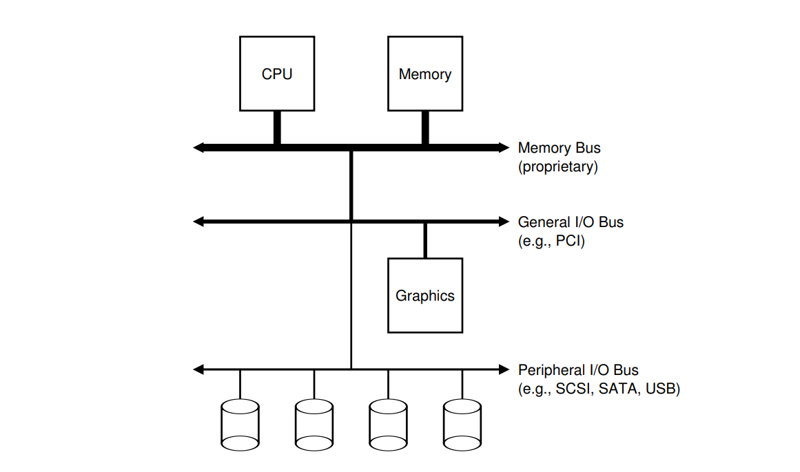

# Ostep_cp36 IO设备

### 计算机系统架构



上图是一种典型的系统结构. 图中CPU通过内存总线和内存相连. 一些设备(如图形设备和高速IO设备)通过通用IO总线(如PCI)和CPU相连. 低俗设备通过外围总线和CPU相连.


### 一个典型的设备


几乎所有的IO设备都有接口和协议以与CPU进行数据通信. 除此之外, IO设备有其内部结构, 在其内部实现提供给CPU的接口抽象.


### 典型的协议

```c
while (STATUS == BUSY)
    ;
write_data_to_data_register();
write_command_to_command_register(); // 启动设备并执行命令
while (STATUS == BUSY)
    ; // 等待设备完成
```

这种协议有以下特点:

* 通过**轮询**的方式周期性的访问设备的状态寄存器. 
* CPU参与数据传输. (我们把有CPU参与的数据传输叫做**programmed IO(PIO)**)
* CPU向设备写命令, 这可以让设备知道数据已经准备好了

协议缺点:

* 性能低下


### 以中断来减轻CPU开销

每次有IO操作的时候, CPU发起IO请求, 之后让发起IO的进程去睡觉并切换至其他进程运行. 当设备完成IO操作的时候, 设备发起硬件中断, CPU于是调用相应的中断处理函数, 最终唤醒发起IO的、在睡觉的进程. 

缺点：

* 如果IO设备的执行速度非常快, 那么轮询将很快就有结果. 明显轮询性能来的更优. 因为中断将导致上下文切换, 减缓系统速度.
* 可能导致**活锁**. 当有大量数据包流, 并且每个包都可能导致中断. 这将导致CPU只忙于处理中断请求,而无法运行用户进程.

优化:

* 混合使用轮询和中断. 当IO设备执行速度快时, 使用轮询. 否则使用中断
* 将中断集中起来, 一并处理. 比如一个中断产生之后, 很快另一个IO操作完成要发起中断. 不妨把两个中断合并起来交给CPU


### 使用DMA进行更高效的数据传输

DMA(Direct Memory Access)的工作方式如下: 为了向设备传输数据, 操作系统实现的DMA引擎告诉DMA数据在内存中的位置、如何拷贝数据以及该向哪个设备传输数据. 告诉了之后, CPU就去忙别的事儿了. 当DMA完成任务后, DMA控制器引发中断告诉CPU任务已完成.


### CPU与设备交互的方法

* 通过指令如in, out可以向设备读写数据. 
* 通过内存映射IO, 这样访问IO设备就如同访问内存一般.

两种方法各有优劣, 在现代OS中, 两种方法都有使用.


