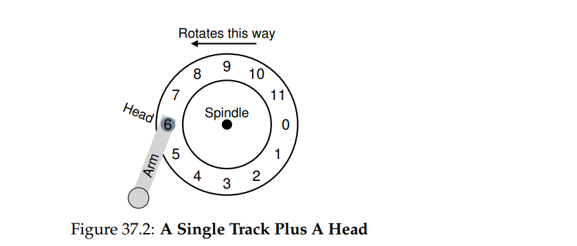
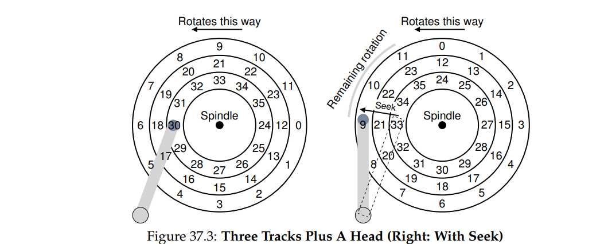

# Ostep_cp37 硬盘HDD

### 接口

现代硬盘设备提供的接口是很直观的. 其包含大量可读写的扇区(sector). 硬盘中的n个扇区从0~n被标识, 因此, 用户亦可视其为一个扇区数组.

多扇区操作亦是可行的. 实际上, 许多文件系统会一次性读写4kb的数据. 然而, 许多硬盘生产商只保证512字节的写操作是原子性的. 因此, 如果系统突发性断电, 只有一小部分的写操作能完成.

### 基本几何结构

一个硬盘由若干盘片构成, 每个 盘片有两面, 这两面都可以通过磁性的改变来存储数据. 这些盘片通过磁柱(spindle)来堆叠在一起. 磁柱会以固定的速率(RPM)来转动盘片, 典型值是7200RPM和15000RPM

盘片上的一环就是一个轨道了. 盘片的一个面上可能包含了成千上万的轨道. 每个轨道上又分了若干的扇区.

数据的读取都是通过磁盘头来进行的, 磁盘头通过磁盘臂在轨道间移动.

### 一个简单的硬盘

* **旋转延迟**

  为了访问到数据, 磁盘头需等到特定的扇区旋转到磁盘头的位置, 比如上图磁盘头停在6号扇区, 其希望读取1号扇区上的数据. 那么就等待盘片旋转使磁盘头落在1号扇区上. 旋转延时轻则为0, 重则为R(旋转一周的时间), 平均为R/2

* **寻轨时间**

  数据并不一定在磁盘头停留的轨道上, 因此需调整轨道. 这个时间的开销不小.

  

### IO时间的计算

***T_IO  = T_seek + T_rotation + T_transfer***

***R_IO = Data_Size /  T_IO***

### 磁盘调度

#### 最短寻轨时间调度

缺点:

* 硬盘的几何结构在OS看来并非扇形结构, 在OS的角度来看, 众多的扇区只是一个数组. 解决方法是以最近的区块优先.
* 饥饿问题, 远处的区块可能不会被访问到.

#### 电梯调度

磁盘臂从磁盘的外延运动到磁盘的内延, 反复这个过程, 就像电梯运行一样. 

缺点:

* 效率并没有想象的那么好, 因为忽略了旋转时延

  

#### 最短访问时间调度

通过计算当前访问哪个扇区所需时间最短来决定先访问谁.

